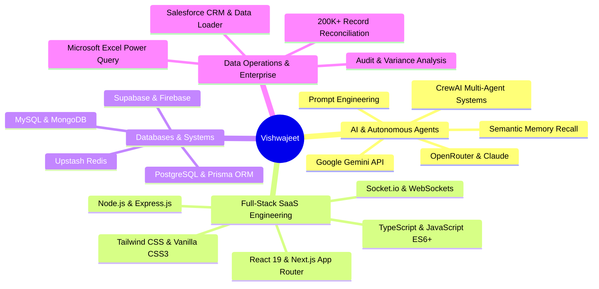

# ⚡ Vishwajeet — Interactive AI & Full-Stack Portfolio 🌐

<div align="center">

[](https://vishwajeetsrk.github.io/)
[](https://vishwajeetsrk.github.io/resume.html)
[](./RESUME.md)
[](https://github.com/Vishwajeetsrk)
[](https://www.linkedin.com/in/vishwajeetsrk/)

<br />

**A state-of-the-art, high-performance personal portfolio, executive resume, and open-source UI design system showcasing cutting-edge Aceternity UI animations converted into lightweight, zero-dependency Vanilla HTML5, CSS3, and JavaScript.**

[Explore Live Demo](https://vishwajeetsrk.github.io/) • [Portfolio Demo](#-interactive-portfolio-demo-walkthrough) • [Projects Gallery](#-live-projects-visual-gallery) • [Detailed Project Showcases](#-detailed-project-showcases) • [UI Component Library](#-ui-animation--components-library)

</div>

---

## 🎬 Interactive Portfolio Demo Walkthrough

<div align="center">

[](https://vishwajeetsrk.github.io/)

<sub>Live screen recording showcasing Aceternity UI components, floating product menus, responsive layout, and native Cal.com booking modal.</sub>

</div>

---

## 🚀 Live Projects Visual Gallery

Click on any project GIF or link below to launch the live production deployment:

| 🚀 [Learnify AI — AI Learning SaaS](https://www.learnifyai.in/) | ⚡ [DreamSync — AI Career Intelligence](https://dream-sync-nine.vercel.app/) |
| :---: | :---: |
| [](https://www.learnifyai.in/) | [](https://dream-sync-nine.vercel.app/) |
| **Stack:** React 19 • TypeScript • Tailwind • Supabase • Cashfree | **Stack:** Next.js • React • Tailwind • Google Gemini API • Redis |
| 🔗 **[Launch Live Demo](https://www.learnifyai.in/)** • 💻 **[GitHub Repository](https://github.com/Vishwajeetsrk/learnifyai)** | 🔗 **[Launch Live Demo](https://dream-sync-nine.vercel.app/)** • 💻 **[GitHub Repository](https://github.com/Vishwajeetsrk/dreamssync_test)** |

| 👔 [Luxury Laundry — Real-Time On-Demand](https://luxurylaundry.vercel.app/) | 🤖 [JARVIS AI OS — Agentic Desktop System](https://jarvisaios.vercel.app/) |
| :---: | :---: |
| [](https://luxurylaundry.vercel.app/) | [](https://jarvisaios.vercel.app/) |
| **Stack:** Next.js • Express.js • PostgreSQL • Prisma • Socket.io | **Stack:** JavaScript • AI Agents • Voice AI • Semantic Recall • Tauri |
| 🔗 **[Launch Live Demo](https://luxurylaundry.vercel.app/)** • 💻 **[GitHub Repository](https://github.com/Vishwajeetsrk/LUXURY-LAUNDRY)** | 🔗 **[Launch Live Demo](https://jarvisaios.vercel.app/)** • 💻 **[GitHub Repository](https://github.com/Vishwajeetsrk/JARVIS-AI-OS)** |

---

## 📖 Table of Contents

- [🚀 Live Projects Visual Gallery](#-live-projects-visual-gallery)
- [🔥 Detailed Project Showcases](#-detailed-project-showcases)
  - [1. Learnify AI — Multi-Modal AI Learning & Career SaaS](#1-learnify-ai--multi-modal-ai-learning--career-saas)
  - [2. DreamSync — AI Career Intelligence & ATS Suite](#2-dreamsync--ai-career-intelligence--ats-suite)
  - [3. Luxury Laundry — Real-Time On-Demand SaaS](#3-luxury-laundry--real-time-on-demand-saas)
  - [4. JARVIS AI OS — Agentic Desktop System](#4-jarvis-ai-os--agentic-desktop-system)
- [🌟 Professional Highlights](#-professional-highlights)
- [🎨 UI Animation & Components Library](#-ui-animation--components-library)
  - [1. Aceternity Cal.com Meeting Scheduler & Modal](#1-aceternity-calcom-meeting-scheduler--modal)
  - [2. Aceternity Dynamic Colourful Text](#2-aceternity-dynamic-colourful-text)
  - [3. Aceternity Floating Navbar & GIF Product Menus](#3-aceternity-floating-navbar--gif-product-menus)
  - [4. Aceternity Hover Border Gradient Button](#4-aceternity-hover-border-gradient-button)
  - [5. Hero Highlight Flashlight & Text Marker Sweep](#5-hero-highlight-flashlight--text-marker-sweep)
  - [6. Aceternity Card Spotlight Flashlight](#6-aceternity-card-spotlight-flashlight)
  - [7. Aceternity Follower Pointer Cursor Pill](#7-aceternity-follower-pointer-cursor-pill)
  - [8. Aceternity Canvas Dot-Matrix Reveal](#8-aceternity-canvas-dot-matrix-reveal)
  - [9. Aceternity Animated Container Text Flip](#9-aceternity-animated-container-text-flip)
  - [10. Aceternity Encrypted Matrix Text Decoder](#10-aceternity-encrypted-matrix-text-decoder)
  - [11. Aceternity Floating Link Preview Popover](#11-aceternity-floating-link-preview-popover)
  - [12. Aceternity Reactive Input Glows](#12-aceternity-reactive-input-glows)
- [🛠️ Core Tech Stack](#️-core-tech-stack)
- [📋 How to Copy & Use Any Component](#-how-to-copy--use-any-component)
- [💻 Local Setup & Quickstart](#-local-setup--quickstart)
- [📬 Contact & Connect](#-contact--connect)

---

## 🔥 Detailed Project Showcases

---

### 1. Learnify AI — Multi-Modal AI Learning & Career SaaS

> **Live Platform:** [https://www.learnifyai.in/](https://www.learnifyai.in/) • **GitHub:** [Vishwajeetsrk/learnifyai](https://github.com/Vishwajeetsrk/learnifyai) • **Video Walkthrough:** [Download / Play MP4 Video](assets/videos/learnify-ai-demo.mp4)

[](https://www.learnifyai.in/)

#### 🎥 Full Production Video Walkthrough
<div align="center">
  <video src="assets/videos/learnify-ai-demo.mp4" controls="controls" width="100%" poster="assets/projects/learnify-ai.gif">
    <p>Your browser does not support HTML5 video playback. <a href="assets/videos/learnify-ai-demo.mp4">Click here to download and view the full Learnify AI MP4 demo</a>.</p>
  </video>
</div>

- **Overview:** End-to-end full-stack AI SaaS platform unifying multi-modal AI tutoring, personalized career roadmapping, AI resume builder, ATS compatibility analyzer, creator publishing tools, and community peer learning.
- **Tech Stack:** React 19, TypeScript, Tailwind CSS, Supabase, OpenRouter API, Cashfree Payment Gateway.
- **Key Features:**
  - Dynamic AI tutoring with contextual multi-turn conversation memory.
  - ATS resume parsing, keyword density scoring, and one-click PDF generation.
  - Integrated subscription monetization with Cashfree payment webhooks.
  - Multi-tenant student dashboard with real-time progress analytics.

---

### 2. DreamSync — AI Career Intelligence & ATS Suite

> **Live Platform:** [https://dream-sync-nine.vercel.app/](https://dream-sync-nine.vercel.app/) • **GitHub:** [Vishwajeetsrk/dreamssync_test](https://github.com/Vishwajeetsrk/dreamssync_test)

[](https://dream-sync-nine.vercel.app/)

- **Overview:** AI-driven career acceleration suite featuring automated ATS resume checking, LinkedIn profile optimization, and dynamic portfolio generation powered by Google Gemini & OpenRouter.
- **Tech Stack:** Next.js App Router, React, Tailwind CSS, Firebase, Google Gemini API, Upstash Redis.
- **Key Features:**
  - Deep semantic comparison between candidate resumes and job descriptions.
  - In-browser AI portfolio website generator with customizable themes.
  - Sub-millisecond rate limiting and caching via Upstash Serverless Redis.
  - Secure authentication and document storage with Firebase Cloud Suite.

---

### 3. Luxury Laundry — Real-Time On-Demand SaaS

> **Live Platform:** [https://luxurylaundry.vercel.app/](https://luxurylaundry.vercel.app/) • **GitHub:** [Vishwajeetsrk/LUXURY-LAUNDRY](https://github.com/Vishwajeetsrk/LUXURY-LAUNDRY)

[](https://luxurylaundry.vercel.app/)

- **Overview:** Full-stack on-demand laundry and garment management platform with synchronized customer order tracking, administrator control center, and live WebSockets status notifications.
- **Tech Stack:** Next.js, Express.js, PostgreSQL, Prisma ORM, Socket.io, Tailwind CSS.
- **Key Features:**
  - Real-time bidirectional order updates with WebSocket streaming (`Socket.io`).
  - Strict ACID transaction management with PostgreSQL and Prisma ORM.
  - Role-based access control (RBAC) distinguishing customers, riders, and admins.
  - Responsive booking flows with time-slot reservation and route calculation.

---

### 4. JARVIS AI OS — Agentic Desktop System

> **Live Platform:** [https://jarvisaios.vercel.app/](https://jarvisaios.vercel.app/) • **GitHub:** [Vishwajeetsrk/JARVIS-AI-OS](https://github.com/Vishwajeetsrk/JARVIS-AI-OS)

[](https://jarvisaios.vercel.app/)

- **Overview:** Experimental AI desktop operating system interface integrating persistent semantic memory recall, autonomous multi-agent task execution, and interactive voice intelligence.
- **Tech Stack:** JavaScript, AI Agents, Voice AI, Semantic Recall, Tauri, Progressive Web App (PWA).
- **Key Features:**
  - Conversational Voice AI agent capable of executing desktop automation commands.
  - Vector-based semantic memory recall retaining long-term contextual facts.
  - Multi-window desktop GUI with movable, resizable agent terminals.
  - Cross-platform packaging support via Tauri framework and PWA caching.

---

## 🌟 Professional Highlights

- **AI SaaS & Full-Stack Architect:** Built and deployed production-grade platforms including **[Learnify AI](https://www.learnifyai.in/)**, **[DreamSync](https://dream-sync-nine.vercel.app/)**, **[Luxury Laundry](https://luxurylaundry.vercel.app/)**, and **[JARVIS AI OS](https://jarvisaios.vercel.app/)**.
- **Enterprise Data Operations Specialist:** Audited, cleansed, and reconciled **200,000+ records** at Rootbridge, resolving 50+ monthly critical discrepancies with a measured **30% accuracy boost** using Microsoft Excel Power Query and Salesforce CRM.
- **Academic Distinction:** BCA Graduate with **First Class Exemplary (8.1 CGPA / 9.06 SGPA | 89.57%)** from St. Aloysius Degree College, Bengaluru North University. Capstone Project: **148/150**; Internship: **99/100**.
- **Accolades & Certifications:** 1st Prize in collegiate Web Design (NEURO2026); Certified in CrewAI Multi-Agent Systems, GitHub Copilot, and GenAI Data Analytics.

---

## 🎨 UI Animation & Components Library

This repository is an open-source showcase of **Aceternity UI components converted to pure Vanilla HTML, CSS, and JS** with **zero React/npm build requirements**. You can drop any of these directly into static websites, WordPress, Shopify, Next.js, or HTML templates.

---

### 1. Aceternity Cal.com Meeting Scheduler & Modal
> **Live Demo:** Click *"Chat with Vishwajeet"* in the top navigation, hero section, or contact area of [vishwajeetsrk.github.io](https://vishwajeetsrk.github.io/)

A pixel-perfect, native replica of the **Cal.com** scheduling experience from Aceternity's Productized Agency template.
- **3-Column Layout:** Left event summary panel, center interactive month date picker, right available slot list.
- **Strict Availability Engine:** Configured for daily recurring availability **`3:00 PM – 9:00 PM IST`** with automatic past-time and past-date disabling.
- **Signature Split-Confirm Interaction:** Clicking any time slot reveals an animated `[ Confirm ]` button that slides forward into attendee details.
- **Clean Booking Form:** Collects Name, Email, and Topic.
- **Direct Multi-Calendar Sync:**
  - 📅 **Google Calendar:** Native tab navigation with exact Universal UTC timestamps, `ctz=Asia/Kolkata`, and Google Meet attachment.
  - 📆 **Outlook Calendar:** Deep link with ISO 8601 UTC timestamps.
  - 💾 **ICS File Download:** Instant native download of RFC 5545 `.ics` file for Apple Calendar, Windows, and Outlook Desktop.
  - 🎥 **Instant Google Meet:** Direct link to `https://meet.google.com/new` for 1-click video calls.

---

### 2. Aceternity Dynamic Colourful Text
> **Live Demo:** Inspect "Vishwajeet", "Skills", "Projects", and "Touch" titles on [vishwajeetsrk.github.io](https://vishwajeetsrk.github.io/)

A vibrant animated text effect inspired by Aceternity UI's `ColourfulText`.
- Dynamically cycles words through a curated gradient spectrum (`#2563eb`, `#e11d48`, `#059669`, `#d97706`, `#7c3aed`, `#0891b2`).
- Breaks target words into individual character spans with staggered spring delays (`transition-delay: calc(index * 25ms)`), smooth blur-ins, and floating upward translations.

---

### 3. Aceternity Floating Navbar & GIF Product Menus
> **Live Demo:** Hover "Projects" in the navbar on [vishwajeetsrk.github.io](https://vishwajeetsrk.github.io/)

A floating navigation bar that delivers an ultra-modern glassmorphic aesthetic.
- **Glassmorphism:** `backdrop-filter: blur(16px)` with responsive light/dark adaptation.
- **GIF Product Thumbnails:** Hovering "Projects" reveals interactive thumbnail cards playing live demo GIFs for all 4 flagship applications!
- **Mobile Menu Drawer:** Dedicated drawer with mobile touch-optimized chat buttons.

---

### 4. Aceternity Hover Border Gradient Button
> **Live Demo:** Hero Section CTA *"Download Resume"* on [vishwajeetsrk.github.io](https://vishwajeetsrk.github.io/)

A button wrapped in an animated border glow layer.
- Uses radial conic gradients and CSS masks to create a smooth, luminous spotlight running along the border perimeter on hover.
- GPU accelerated and non-blocking.

---

### 5. Hero Highlight Flashlight & Text Marker Sweep
> **Live Demo:** Hero Section on [vishwajeetsrk.github.io](https://vishwajeetsrk.github.io/)

- **Flashlight Beam:** Follows the user's cursor across a subtle SVG dot-matrix grid (`--hh-x`, `--hh-y`), illuminating surrounding dots dynamically.
- **Highlighter Sweep:** Automatically sweeps an animated vibrant marker highlight over key terms after hero load (`.highlight-marker.marker-active`).

---

### 6. Aceternity Card Spotlight Flashlight
> **Live Demo:** About & Experience cards on [vishwajeetsrk.github.io](https://vishwajeetsrk.github.io/)

- Tracks pointer coordinates relative to card boundaries.
- Emits a smooth radial illumination gradient behind the active card surface (`rgba(56, 189, 248, 0.12)`) without affecting text legibility.

---

### 7. Aceternity Follower Pointer Cursor Pill
> **Live Demo:** Experience Timeline (Rootbridge & ViewMyRecords) on [vishwajeetsrk.github.io](https://vishwajeetsrk.github.io/)

- When hovering over designated interactive cards, the browser spawns a customized cursor follower pill containing an avatar, label, and custom brand color badge.
- Automatically handles enter/move/leave with linear interpolation (lerp) smoothing.

---

### 8. Aceternity Canvas Dot-Matrix Reveal
> **Live Demo:** Education Section on [vishwajeetsrk.github.io](https://vishwajeetsrk.github.io/)

- Real-time HTML5 `<canvas>` that renders an interactive dot matrix grid.
- Proximity-based mouse repulsion: dots dynamically enlarge and illuminate with cyan/blue halos as the cursor passes through.

---

### 9. Aceternity Animated Container Text Flip
> **Live Demo:** Hero Subtitle ("AI Software Engineer", "Full Stack Developer", "Data Operations Specialist")

- Seamless 3D vertical character flip rotating words on an automated timer with realistic perspective depth (`rotateX`).

---

### 10. Aceternity Encrypted Matrix Text Decoder
> **Live Demo:** Section titles on [vishwajeetsrk.github.io](https://vishwajeetsrk.github.io/)

- Cyberpunk cryptographic decipher animation that scrambles characters into randomized matrix symbols (`!@#$%^&*<>[]{}01`) before resolving to final plaintext.

---

### 11. Aceternity Floating Link Preview Popover
> **Live Demo:** External links on [vishwajeetsrk.github.io](https://vishwajeetsrk.github.io/)

- Hovering over project or social links smoothly elevates a floating card popover displaying a snapshot thumbnail, title, and hostname.

---

### 12. Aceternity Reactive Input Glows
> **Live Demo:** Contact form on [vishwajeetsrk.github.io](https://vishwajeetsrk.github.io/)

- Form inputs listen to mouse movements and project a radial gradient focus halo that tracks the cursor along the input borders.

---

## 🛠️ Core Tech Stack



---

## 📋 How to Copy & Use Any Component

All components are written in standard **Vanilla HTML5, CSS3, and JavaScript**, making them fully portable without npm dependencies.

### Step 1: Copy Core CSS
Include the styles from [`css/style.css`](file:///c:/Users/Vishwajeet/OneDrive/Documents/vishwajeetsrk.github.io/css/style.css) into your stylesheet or `<style>` block.

### Step 2: Copy Component HTML
Grab the component markup from [`index.html`](file:///c:/Users/Vishwajeet/OneDrive/Documents/vishwajeetsrk.github.io/index.html) (e.g., `.cal-modal-overlay`, `.colourful-text`, `.card-spotlight`, `.hover-border-gradient-btn`).

### Step 3: Initialize JavaScript
Call the respective initialization function from [`js/main.js`](file:///c:/Users/Vishwajeet/OneDrive/Documents/vishwajeetsrk.github.io/js/main.js):
```javascript
document.addEventListener('DOMContentLoaded', () => {
    initializeNavbarMenu();
    initializeColourfulText();
    initializeBookChatAnimation();
    initializeHeroHighlight();
    initializeCardSpotlight();
    initializeFollowerPointer();
    initializeEducationCanvasReveal();
    initializeContainerTextFlip();
    initializeEncryptedText();
    initializeLinkPreview();
    initializeAceternityInputs();
});
```

---

## 💻 Local Setup & Quickstart

To run the portfolio locally:

1. **Clone the repository:**
   ```bash
   git clone https://github.com/Vishwajeetsrk/vishwajeetsrk.github.io.git
   cd vishwajeetsrk.github.io
   ```

2. **Serve locally:**
   You can use any local HTTP server:
   ```bash
   # Using Python 3:
   python -m http.server 8000
   
   # Or using Node:
   npx serve .
   ```

3. **Open in browser:**
   ```
   http://localhost:8000/
   ```

---

## 📄 Resumes Available

- 🌐 **[Interactive Web Resume (`resume.html`)](https://vishwajeetsrk.github.io/resume.html)** — Optimized for 1-click printing and PDF saving with tailored `@media print` typography.
- 📝 **[ATS-Friendly Markdown Resume (`RESUME.md`)](./RESUME.md)** — Formatted with STAR/XYZ quantifiable impact metrics.

---

## 📬 Contact & Connect

- **Portfolio:** [vishwajeetsrk.github.io](https://vishwajeetsrk.github.io/)
- **Book 30 Min Meeting (Cal.com):** [cal.com/vishwajeet-srk/30min](https://cal.com/vishwajeet-srk/30min)
- **Book 15 Min Quick Chat (Cal.com):** [cal.com/vishwajeet-srk/15min](https://cal.com/vishwajeet-srk/15min)
- **Email:** [vishwajeetsrk@gmail.com](mailto:vishwajeetsrk@gmail.com)
- **LinkedIn:** [linkedin.com/in/vishwajeetsrk](https://www.linkedin.com/in/vishwajeetsrk/)
- **GitHub:** [github.com/Vishwajeetsrk](https://github.com/Vishwajeetsrk)
- **Location:** Bengaluru, Karnataka, India

---

<div align="center">
  <sub>Crafted with passion, precision, and modern UI engineering by <strong>Vishwajeet</strong>. © 2026 All Rights Reserved.</sub>
</div>
