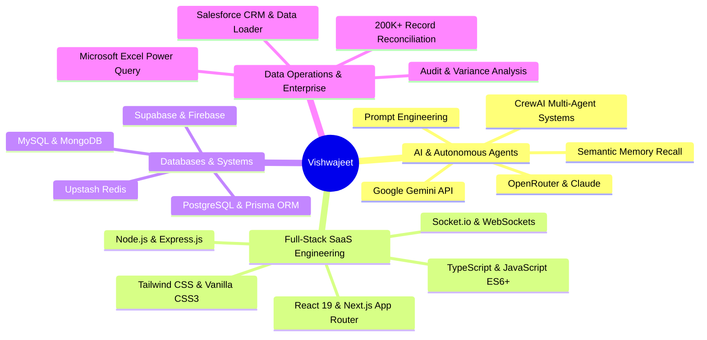

# ⚡ Vishwajeet — Interactive AI & Full-Stack Portfolio 🌐

<div align="center">

[](https://vishwajeetsrk.github.io/)
[](https://vishwajeetsrk.github.io/resume.html)
[](./RESUME.md)
[](https://github.com/Vishwajeetsrk)
[](https://www.linkedin.com/in/vishwajeetsrk/)

<br />

**A state-of-the-art, high-performance personal portfolio, executive resume, and open-source UI design system showcasing cutting-edge Aceternity UI animations converted into lightweight, zero-dependency Vanilla HTML5, CSS3, and JavaScript.**

[Explore Live Demo](https://vishwajeetsrk.github.io/) • [UI Component Library](#-ui-animation--components-library) • [Flagship Projects](#-flagship-projects) • [How to Use & Copy](#-how-to-copy--use-any-component) • [Local Setup](#-local-setup--quickstart)

</div>

---

## 📖 Table of Contents

- [🌟 Professional Highlights](#-professional-highlights)
- [🎨 UI Animation & Components Library](#-ui-animation--components-library)
  - [1. Aceternity Cal.com Meeting Scheduler & Booking Modal](#1-aceternity-calcom-meeting-scheduler--booking-modal)
  - [2. Aceternity Dynamic Colourful Text](#2-aceternity-dynamic-colourful-text)
  - [3. Aceternity Floating Navbar & Product Menus](#3-aceternity-floating-navbar--product-menus)
  - [4. Aceternity Hover Border Gradient Button](#4-aceternity-hover-border-gradient-button)
  - [5. Hero Highlight Flashlight & Text Marker Sweep](#5-hero-highlight-flashlight--text-marker-sweep)
  - [6. Aceternity Card Spotlight Flashlight](#6-aceternity-card-spotlight-flashlight)
  - [7. Aceternity Follower Pointer Cursor Pill](#7-aceternity-follower-pointer-cursor-pill)
  - [8. Aceternity Canvas Dot-Matrix Reveal](#8-aceternity-canvas-dot-matrix-reveal)
  - [9. Aceternity Animated Container Text Flip](#9-aceternity-animated-container-text-flip)
  - [10. Aceternity Encrypted Matrix Text Decoder](#10-aceternity-encrypted-matrix-text-decoder)
  - [11. Aceternity Floating Link Preview Popover](#11-aceternity-floating-link-preview-popover)
  - [12. Aceternity Reactive Input Glows](#12-aceternity-reactive-input-glows)
- [🚀 Flagship Projects](#-flagship-projects)
- [🛠️ Core Tech Stack](#️-core-tech-stack)
- [📋 How to Copy & Use Any Component](#-how-to-copy--use-any-component)
- [💻 Local Setup & Quickstart](#-local-setup--quickstart)
- [📬 Contact & Connect](#-contact--connect)

---

## 🌟 Professional Highlights

- **AI SaaS & Full-Stack Architect:** Built production-grade platforms including **[Learnify AI](https://www.learnifyai.in/)**, **[DreamSync](https://dream-sync-nine.vercel.app/)**, **[Luxury Laundry](https://luxurylaundry.vercel.app/)**, and **[JARVIS AI OS](https://jarvisaios.vercel.app/)**.
- **Enterprise Data Operations Specialist:** Audited, cleansed, and reconciled **200,000+ records** at Rootbridge, resolving 50+ monthly critical discrepancies with a measured **30% accuracy boost** using Microsoft Excel Power Query and Salesforce CRM.
- **Academic Distinction:** BCA Graduate with **First Class Exemplary (8.1 CGPA / 9.06 SGPA | 89.57%)** from St. Aloysius Degree College, Bengaluru North University. Capstone Project: **148/150**; Internship: **99/100**.
- **Accolades & Certifications:** 1st Prize in collegiate Web Design (NEURO2026); Certified in CrewAI Multi-Agent Systems, GitHub Copilot, and GenAI Data Analytics.

---

## 🎨 UI Animation & Components Library

This repository doubles as an open-source showcase of **Aceternity UI components converted to pure Vanilla HTML, CSS, and JS** with **zero React/npm build requirements**. You can drop any of these directly into static websites, WordPress, Shopify, Next.js, or HTML templates.

---

### 1. Aceternity Cal.com Meeting Scheduler & Booking Modal
> **Live Demo:** Click *"Chat with Vishwajeet"* in the top navigation or hero section of [vishwajeetsrk.github.io](https://vishwajeetsrk.github.io/)

A pixel-perfect replica of the **Cal.com** scheduling experience from Aceternity's Productized Agency template.
- **3-Column Architecture:** Left event summary panel, center interactive month date picker, right available slot list.
- **Strict Availability Engine:** Configured for daily recurring availability **`3:00 PM – 7:30 PM IST`** with automatic past-time and past-date disabling.
- **Signature Split-Confirm Interaction:** Clicking any time slot reveals an animated `[ Confirm ]` button that slides forward into attendee details.
- **Multi-Channel Delivery:** Collects Name, Email, **Mobile / WhatsApp Number**, and Topic. Sends full notifications and provides instant WhatsApp messaging.
- **Multi-Calendar Sync:** One-click integration with **Google Calendar**, **Outlook (Live/365)**, and dynamic on-the-fly **`.ics` iCalendar file generation** for native desktop import.
- **Reschedule & Cancel Workflows:** Full state rollback and rescheduling controls.

#### How to Copy & Use:
1. **HTML Markup:**
```html
<div class="cal-modal-overlay" id="chatModalOverlay">
  <div class="cal-modal-window">
    <button class="cal-modal-close" id="chatModalClose"><i class="fas fa-times"></i></button>
    <div class="cal-modal-content" id="calBookingView">
      <!-- Sidebar -->
      <div class="cal-sidebar">...</div>
      <!-- Date Picker -->
      <div class="cal-date-picker">...</div>
      <!-- Time Slots -->
      <div class="cal-time-slots" id="calTimeSlotsPanel">...</div>
      <!-- Attendee Form -->
      <div class="cal-details-panel" id="calDetailsPanel" style="display:none;">...</div>
    </div>
    <!-- Confirmation Screen -->
    <div class="cal-success-view" id="calSuccessView" style="display:none;">...</div>
  </div>
</div>
```
2. **CSS:** Copy `.cal-modal-overlay`, `.cal-modal-window`, `.cal-slot-btn`, and `.cal-meeting-card` rules from [`css/style.css`](file:///c:/Users/Vishwajeet/OneDrive/Documents/vishwajeetsrk.github.io/css/style.css).
3. **JS:** Call `initializeBookChatAnimation()` from [`js/main.js`](file:///c:/Users/Vishwajeet/OneDrive/Documents/vishwajeetsrk.github.io/js/main.js).

---

### 2. Aceternity Dynamic Colourful Text
> **Live Demo:** Inspect "Vishwajeet", "Skills", "Projects", and "Touch" titles on [vishwajeetsrk.github.io](https://vishwajeetsrk.github.io/)

A vibrant animated text effect inspired by Aceternity UI's `ColourfulText`.
- Dynamically cycles words through a curated gradient spectrum (`#2563eb`, `#e11d48`, `#059669`, `#d97706`, `#7c3aed`, `#0891b2`).
- Breaks target words into individual character spans with staggered spring delays (`transition-delay: calc(index * 25ms)`), smooth blur-ins, and floating upward translations.

#### How to Copy & Use:
```html
<h2>Featured <span class="colourful-text" data-text="Projects">Projects</span></h2>
```
```javascript
// Add to your JS:
function initializeColourfulText() {
  document.querySelectorAll('.colourful-text').forEach(el => {
    const text = el.getAttribute('data-text') || el.textContent;
    el.innerHTML = text.split('').map((char, i) => 
      `<span class="colourful-char" style="--char-idx: ${i}">${char === ' ' ? '&nbsp;' : char}</span>`
    ).join('');
  });
}
```

---

### 3. Aceternity Floating Navbar & Product Menus
> **Live Demo:** Top header on [vishwajeetsrk.github.io](https://vishwajeetsrk.github.io/)

A floating navigation bar that delivers a modern glassmorphic aesthetic.
- **Glassmorphism:** `backdrop-filter: blur(16px)` with responsive light/dark adaptation.
- **Dropdown Menus:** Hover triggers smooth vertical card dropdowns featuring custom gradient badge icons, micro-descriptions, and subtle spring elevation.
- **Mobile Menu Drawer:** Dedicated drawer with mobile touch-optimized chat buttons.

---

### 4. Aceternity Hover Border Gradient Button
> **Live Demo:** Hero Section CTA *"Download Resume"* on [vishwajeetsrk.github.io](https://vishwajeetsrk.github.io/)

A button wrapped in an animated border glow layer.
- Uses radial conic gradients and CSS masks to create a smooth, luminous spotlight running along the border perimeter on hover.
- GPU accelerated and non-blocking.

---

### 5. Hero Highlight Flashlight & Text Marker Sweep
> **Live Demo:** Hero Section on [vishwajeetsrk.github.io](https://vishwajeetsrk.github.io/)

- **Flashlight Beam:** Follows the user's cursor across a subtle SVG dot-matrix grid (`--hh-x`, `--hh-y`), illuminating surrounding dots dynamically.
- **Highlighter Sweep:** Automatically sweeps an animated vibrant marker highlight over key terms after hero load (`.highlight-marker.marker-active`).

---

### 6. Aceternity Card Spotlight Flashlight
> **Live Demo:** About & Experience cards on [vishwajeetsrk.github.io](https://vishwajeetsrk.github.io/)

- Tracks pointer coordinates relative to card boundaries.
- Emits a smooth radial illumination gradient behind the active card surface (`rgba(56, 189, 248, 0.12)`) without affecting text legibility.

---

### 7. Aceternity Follower Pointer Cursor Pill
> **Live Demo:** Experience Timeline (Rootbridge & ViewMyRecords) on [vishwajeetsrk.github.io](https://vishwajeetsrk.github.io/)

- When hovering over designated interactive cards, the browser spawns a customized cursor follower pill containing an avatar, label, and custom brand color badge.
- Automatically handles enter/move/leave with linear interpolation (lerp) smoothing.

---

### 8. Aceternity Canvas Dot-Matrix Reveal
> **Live Demo:** Education Section on [vishwajeetsrk.github.io](https://vishwajeetsrk.github.io/)

- Real-time HTML5 `<canvas>` that renders an interactive dot matrix grid.
- Proximity-based mouse repulsion: dots dynamically enlarge and illuminate with cyan/blue halos as the cursor passes through.

---

### 9. Aceternity Animated Container Text Flip
> **Live Demo:** Hero Subtitle ("AI Software Engineer", "Full Stack Developer", "Data Operations Specialist")

- Seamless 3D vertical character flip rotating words on an automated timer with realistic perspective depth (`rotateX`).

---

### 10. Aceternity Encrypted Matrix Text Decoder
> **Live Demo:** Section titles on [vishwajeetsrk.github.io](https://vishwajeetsrk.github.io/)

- Cyberpunk cryptographic decipher animation that scrambles characters into randomized matrix symbols (`!@#$%^&*<>[]{}01`) before resolving to final plaintext.

---

### 11. Aceternity Floating Link Preview Popover
> **Live Demo:** External links on [vishwajeetsrk.github.io](https://vishwajeetsrk.github.io/)

- Hovering over project or social links smoothly elevates a floating card popover displaying a snapshot thumbnail, title, and hostname.

---

### 12. Aceternity Reactive Input Glows
> **Live Demo:** Contact form on [vishwajeetsrk.github.io](https://vishwajeetsrk.github.io/)

- Form inputs listen to mouse movements and project a radial gradient focus halo that tracks the cursor along the input borders.

---

## 🚀 Flagship Projects

| Project | Live Demo | Repository | Description | Technologies |
|---|---|---|---|---|
| **Learnify AI** | [Live Platform](https://www.learnifyai.in/) | [GitHub](https://github.com/Vishwajeetsrk/learnifyai) | End-to-end full-stack AI SaaS platform unifying multi-modal AI tutoring, career roadmapping, resume builder, and creator tools. | React 19, TypeScript, Tailwind, Supabase, OpenRouter API, Cashfree |
| **DreamSync** | [Live Platform](https://dream-sync-nine.vercel.app/) | [GitHub](https://github.com/Vishwajeetsrk/dreamssync_test) | AI-driven career acceleration suite featuring automated ATS resume checking, LinkedIn optimization, and portfolio generation. | Next.js, React, Tailwind, Firebase, Google Gemini, Upstash Redis |
| **Luxury Laundry** | [Live Platform](https://luxurylaundry.vercel.app/) | [GitHub](https://github.com/Vishwajeetsrk/LUXURY-LAUNDRY) | Real-time on-demand laundry management platform with synchronized order tracking and live WebSockets status notifications. | Next.js, Express.js, PostgreSQL, Prisma ORM, Socket.io, Tailwind |
| **JARVIS AI OS** | [Live Platform](https://jarvisaios.vercel.app/) | [GitHub](https://github.com/Vishwajeetsrk/JARVIS-AI-OS) | Experimental desktop operating system interface integrating persistent semantic memory recall, voice AI, and autonomous agent tasks. | JavaScript, AI Agents, Voice AI, Semantic Recall, Tauri, PWA |
| **TaskFlow** | [Live Platform](https://taskflow-production-9ca3.up.railway.app/login) | [GitHub](https://github.com/Vishwajeetsrk/TaskFlow) | Full-stack production task management application featuring JWT authentication, task CRUD workflows, and gamification. | Node.js, Express.js, MongoDB, EJS, Railway |
| **Enterprise Data Reconciliation** | [Live Portfolio](https://vishwajeetsrk.github.io/) | [GitHub](https://github.com/Vishwajeetsrk) | High-volume validation pipeline reconciling 200,000+ Salesforce CRM and Excel records with a 30% measured accuracy boost. | Salesforce CRM, Data Loader, Power Query, Excel, Python |

---

## 🛠️ Core Tech Stack



---

## 📋 How to Copy & Use Any Component

All components are written in standard **Vanilla HTML5, CSS3, and JavaScript**, making them fully portable without npm dependencies.

### Step 1: Copy Core CSS
Include the styles from [`css/style.css`](file:///c:/Users/Vishwajeet/OneDrive/Documents/vishwajeetsrk.github.io/css/style.css) into your stylesheet or `<style>` block.

### Step 2: Copy Component HTML
Grab the component markup from [`index.html`](file:///c:/Users/Vishwajeet/OneDrive/Documents/vishwajeetsrk.github.io/index.html) (e.g., `.cal-modal-overlay`, `.colourful-text`, `.card-spotlight`, `.hover-border-gradient-btn`).

### Step 3: Initialize JavaScript
Call the respective initialization function from [`js/main.js`](file:///c:/Users/Vishwajeet/OneDrive/Documents/vishwajeetsrk.github.io/js/main.js):
```javascript
document.addEventListener('DOMContentLoaded', () => {
    initializeNavbarMenu();
    initializeColourfulText();
    initializeBookChatAnimation();
    initializeHeroHighlight();
    initializeCardSpotlight();
    initializeFollowerPointer();
    initializeEducationCanvasReveal();
    initializeContainerTextFlip();
    initializeEncryptedText();
    initializeLinkPreview();
    initializeAceternityInputs();
});
```

---

## 💻 Local Setup & Quickstart

To run the portfolio locally:

1. **Clone the repository:**
   ```bash
   git clone https://github.com/Vishwajeetsrk/vishwajeetsrk.github.io.git
   cd vishwajeetsrk.github.io
   ```

2. **Serve locally:**
   You can use any local HTTP server:
   ```bash
   # Using Python 3:
   python -m http.server 8000
   
   # Or using Node:
   npx serve .
   ```

3. **Open in browser:**
   ```
   http://localhost:8000/
   ```

---

## 📄 Resumes Available

- 🌐 **[Interactive Web Resume (`resume.html`)](https://vishwajeetsrk.github.io/resume.html)** — Optimized for 1-click printing and PDF saving with tailored `@media print` typography.
- 📝 **[ATS-Friendly Markdown Resume (`RESUME.md`)](./RESUME.md)** — Formatted with STAR/XYZ quantifiable impact metrics.

---

## 📬 Contact & Connect

- **Portfolio:** [vishwajeetsrk.github.io](https://vishwajeetsrk.github.io/)
- **Email:** [vishwajeetsrk@gmail.com](mailto:vishwajeetsrk@gmail.com)
- **Phone / WhatsApp:** [+91 85952 02922](tel:+918595202922)
- **LinkedIn:** [linkedin.com/in/vishwajeetsrk](https://www.linkedin.com/in/vishwajeetsrk/)
- **GitHub:** [github.com/Vishwajeetsrk](https://github.com/Vishwajeetsrk)
- **Location:** Bengaluru, Karnataka, India

---

<div align="center">
  <sub>Crafted with passion, precision, and modern UI engineering by <strong>Vishwajeet</strong>. © 2026 All Rights Reserved.</sub>
</div>
